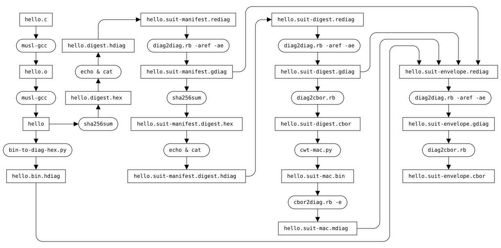

# suit-manifest-generator2

The suit-manifest-generator supports manifest Authors to create SUIT Manifest for firmware image(s),
based on the internet drafts below.
* [A Concise Binary Object Representation (CBOR)-based Serialization Format for the Software Updates for Internet of Things (SUIT) Manifest](https://datatracker.ietf.org/doc/html/draft-ietf-suit-manifest)
* [Update Management Extensions for Software Updates for Internet of Things (SUIT) Manifests](https://datatracker.ietf.org/doc/html/draft-ietf-suit-update-management)
* [SUIT Manifest Extensions for Multiple Trust Domains](https://datatracker.ietf.org/doc/html/draft-ietf-suit-trust-domains)
* [Encrypted Payloads in SUIT Manifests](https://datatracker.ietf.org/doc/html/draft-ietf-suit-firmware-encryption)

The sample materials below use CBOR diagnostic notation with `e''` and `ref''` representations defined in [External References to Values in CBOR Diagnostic Notation (EDN)](https://datatracker.ietf.org/doc/html/draft-ietf-cbor-edn-e-ref) for better readability and modifiability.
* hello.suit-manifest.rediag: the main manifest part containing the metadata for firmware installation
* hello.suit-digest.rediag: the sha256 digest of the manifest in `SUIT_Digest`
* hello.suit-envelope.rediag: the manifest wrapper containing the MAC and/or the digital signature of the manifest

## Quick start

As an example, this tool generates a "hello, world!" binary (`hello`) and
its SUIT Manifest (`hello.suit-envelope.cbor`) described below.


### Install & Preparataion
On Debian/Ubuntu environment, run commands below.
```bash
sudo apt-get install -y git
git clone https://github.com/kentakayama/suit-manifest-generator
cd suit-manifest-generator/cbor-diag-ref-e
sudo apt-get -y install curl gcc make ruby ruby-dev python3 python3-pip
pip3 install --user -r requirements.txt
sudo gem install cbor-diag cbor-diag-e cddlc cbor-diag-ref cddl
make -C cddl
```

### Run
This command generates `hello.suit-envelope.cbor` and validates it with [the CDDL of SUIT Manifest](https://datatracker.ietf.org/doc/html/draft-ietf-suit-manifest#name-full-cddl).

```bash
make test
```

The sequence is described below. See [Makefile](./Makefile) for detail.


