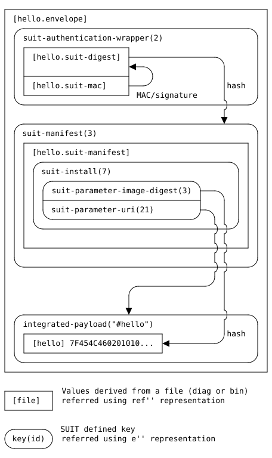
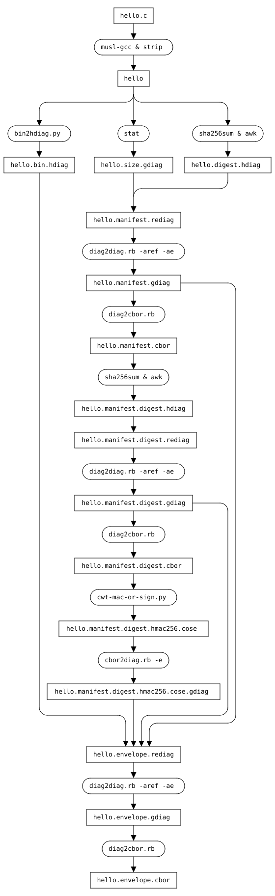

# Hello World

This sample program generates an encrypted "hello, world!" static binary (`hello`) and
its SUIT Manifest (`hello.envelope.cbor`) described below.
It also validates the SUIT Manifest with [the CDDL of SUIT Manifest](https://datatracker.ietf.org/doc/html/draft-ietf-suit-manifest#name-full-cddl).



## Run
See [Install & Preparataion](../README.md#install--preparataion)

```bash
make test
```

The sequence is described below. See [Makefile](./Makefile) for detail.


